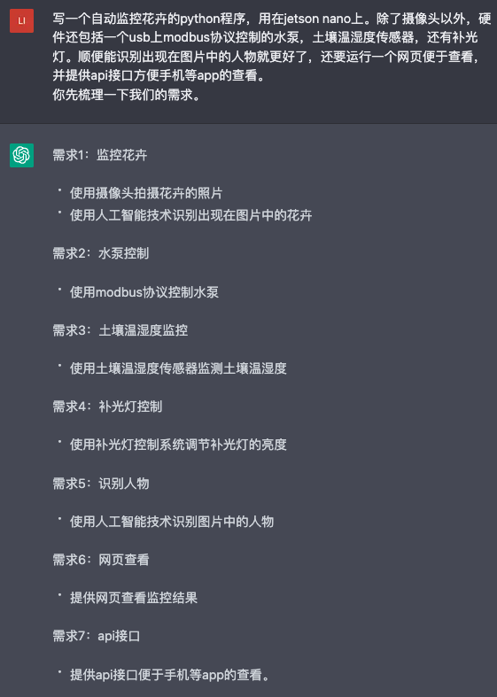

# Kergal Flower Control

## Introduction

The repo is totally instructed by the [ChatGPT](https://chat.openai.com/chat) provided by OpenAI.
Please refer to the OpenAI for more details.

## Requirements
1. Monitoring flowers
    - Using a camera to take photos of flowers
    - Using AI technology to recognize flowers in the photos
2. Pump control
    - Using modbus protocol to control the pump
3. Soil temperature and humidity monitoring
    - Using a soil temperature and humidity sensor to monitor soil temperature and humidity
4. Illumination lamp control
    - Using an illumination lamp control system to adjust the brightness of the illumination lamp
5. Recognizing people
    - Using AI technology to recognize people in the photos
6. Web viewing
    - Providing a web page to view monitoring results
7. API interface
    - Providing an API interface for easy viewing on mobile apps.

